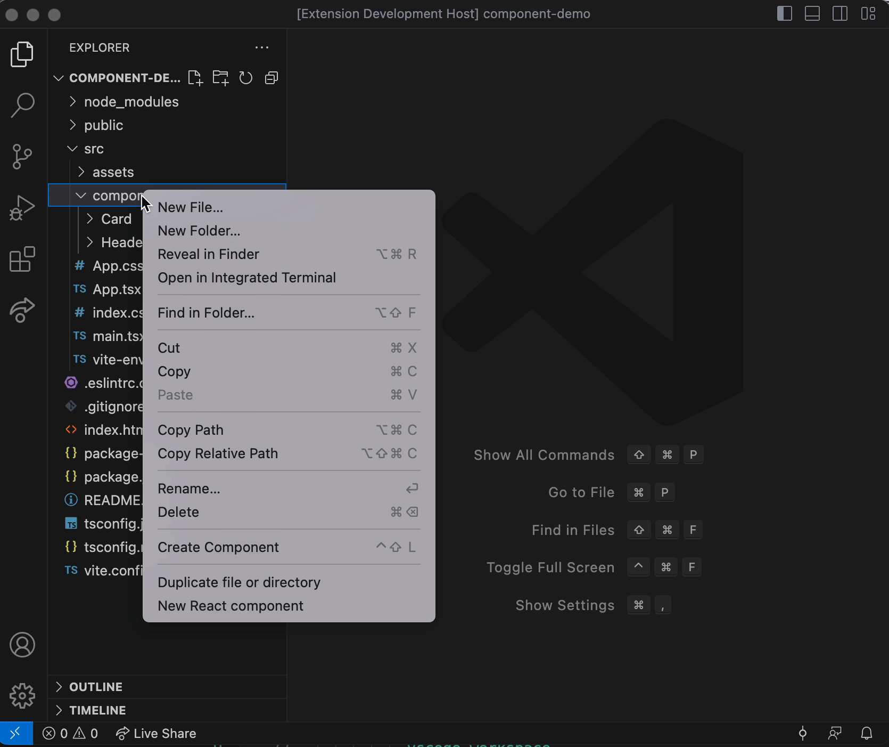

# Fast React component generator for Vscode

One-click generator to create new React components based on best practices. 

It will create:

- A new folder
- - {name}.tsx
- - {name}.css (or .module.css | .module.scss)
- - {name}.stories.tsx (optional)
- - index.ts

## Demo

## Installation
Download on the .

## Release Notes

### 1.1.0

Add user selectable options for SCSS, CSS modules and Storybook.

### 1.0.0

Initial release of the Fast React component generator.
